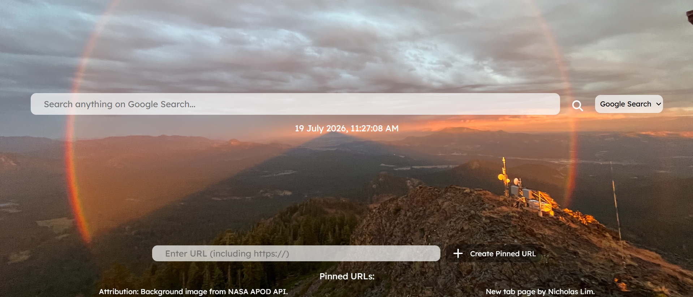

# Nicholas' New Tab

A custom new tab with NASA's APOD Image as the background, URL pins with `localStorage` and multiple search engines, all in one tab.

## Features
- Select between 4 search engines for your queries!
- Create pins for frequently visited URLs!
- Refreshed wallpapers from APOD API everyday!

## Usage
You may either download it locally, create a `.env` (see <a href=".env.sample">.env.sample</a>) and build it with `npm run dev` or use the hosted version (API limits may apply): <a href="https://nicholaslim.me/new-tab/">https://nicholaslim.me/new-tab/</a>